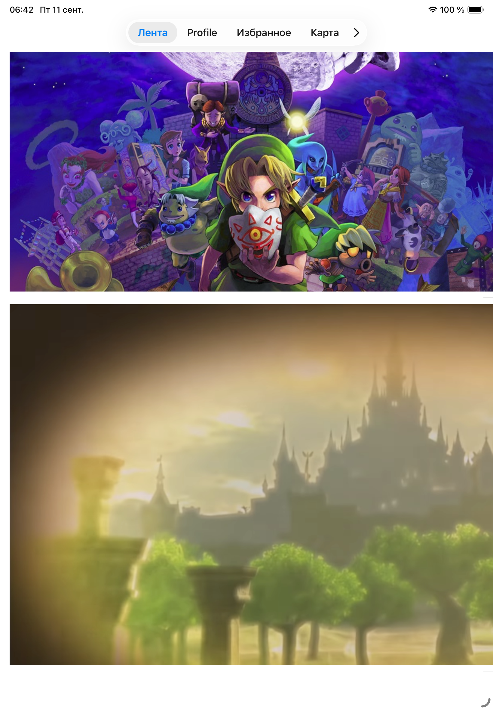
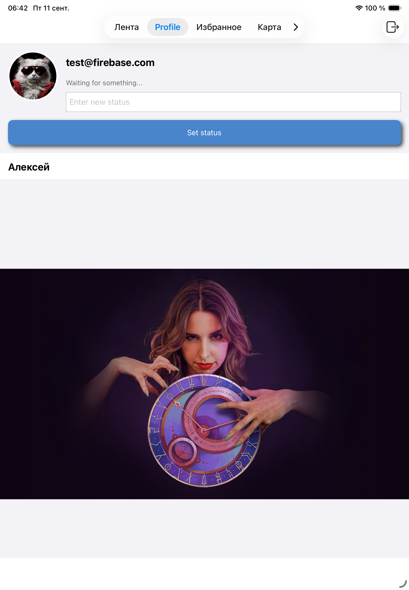
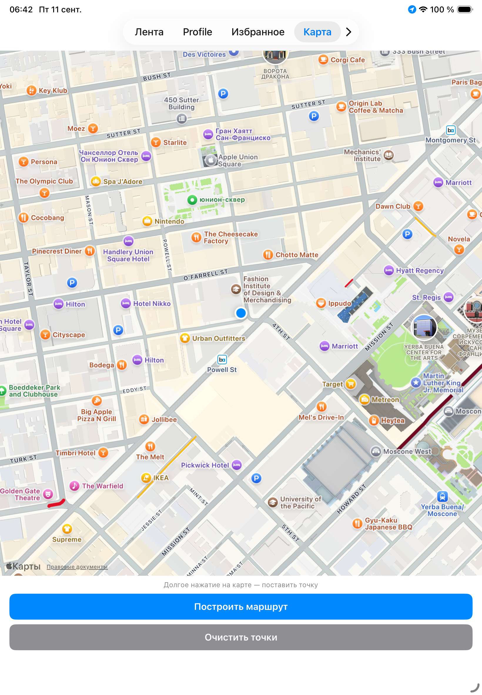

# Navigation — VK-подобное приложение (дипломный проект)

Дипломная работа курса «iOS-разработчик». Приложение выросло из серии домашних
заданий модуля «iOS-dev: интерфейс приложения» и было доработано до отдельного
цельного продукта: лента постов, профиль пользователя с drag&drop, авторизация
через Firebase, плюс несколько дополнительных разделов (агрегатор цитат,
карта), оставшихся от промежуточных домашних заданий.

## Скриншоты

_TODO: вставить сюда 4–6 скриншотов с симулятора — экран логина, лента,
профиль, настройки/карта. Проще всего — `⌘S` на симуляторе, перетащить готовые
PNG в папку `Screenshots/` в репозитории и подставить ссылки ниже:_

| Логин | Лента | Профиль |
|---|---|---|
|  |  |  |

## Функциональность

### Основные экраны
- **Авторизация** — вход/регистрация через Firebase Auth (email/пароль,
  авто-регистрация при первом входе), опционально Face ID / Touch ID.
- **Лента** — список постов с картинками, лайками и просмотрами; добавление в
  избранное.
- **Профиль** — аватар, статус, список собственных постов; drag&drop картинки
  и текста поста между приложением и системными Notes/Messages (специфично
  для iPad); выход из аккаунта.
- **Избранное** — сохранённые посты с фильтром по автору.
- **Карта** — геолокация пользователя, постановка меток долгим тапом,
  построение маршрута через MKDirections.
- **Агрегатор цитат** (Random / All / Categories) — API случайных цитат,
  локальное кеширование через Realm.

### Сквозная функциональность
- Локализация (ru/en) большинства экранов, включая множественное число
  («1 лайк» / «2 лайка» / «5 лайков») через `.stringsdict`.
- Тёмная тема на большинстве экранов через собственную палитру `AppColors`.
- Локальные push-уведомления (ежедневное напоминание в 19:00, кастомная
  категория с действием).
- Unit-тесты на `FeedViewModel`/`LoginViewModel` (XCTest, DI через протоколы).

## Архитектура

- **MVVM** — для всех экранов с бизнес-логикой (`FeedViewController`,
  `LoginViewController`, агрегатор цитат, избранное); View Controller
  занимаются только UI и подпиской на коллбэки своей ViewModel. Исключение —
  `MapViewController`, который целиком построен вокруг
  `MKMapViewDelegate`/`CLLocationManagerDelegate` и оставлен на MVC осознанно:
  вынесение тонкого ViewModel добавило бы формальный слой ради самой формы, а
  не реальное разделение ответственности.
- **Coordinator** — только для профиля (`ProfileCoordinator`), управляет
  переходом к деталям поста. Остальная навигация собирается напрямую в
  `MainTabBarController`/`SceneDelegate` — отдельный `AppCoordinator` для
  всего приложения не оправдал себя на масштабе проекта и был удалён вместе
  с остальным неиспользуемым кодом.
- **Сервисный слой с протоколами** — бизнес-логика скрыта за протоколами
  (`PostsServiceProtocol`, `FavoritesStoring`, `CheckerServiceProtocol`),
  что позволяет подменять их фейками в unit-тестах без обращения к реальной
  базе или сети.
- **Стайлгайд** — `AppColors` (`Library/ExtensionUIColor.swift`) и `AppFonts`
  (`Library/AppTypography.swift`) — все цвета и шрифты приложения собраны в
  этих двух файлах, экраны используют только их, без inline UIColor/UIFont.

## Хранение данных

- **Realm** (зашифрован, ключ в Keychain) — цитаты и посты ленты/профиля.
  Единое хранилище: `FeedViewController` и `ProfileViewController` читают
  посты из одного и того же `PostsService`, а не из отдельных источников.
- **CoreData** — избранные посты.
- **Firebase Auth** — учётные записи пользователей.
- Внешние API/облачные БД (Firestore/Storage) сознательно не используются —
  требуют привязки платёжного аккаунта (план Blaze), не подходит для учебного
  проекта.

## Стек

Swift, UIKit (код, без сторибордов, кроме системного `LaunchScreen`),
Auto Layout, MVVM + Coordinator (частично), RealmSwift, CoreData,
Firebase (Auth), MapKit, CoreLocation, LocalAuthentication, UserNotifications,
XCTest.

## Запуск проекта

1. `pod install` (CocoaPods).
2. Открыть `Navigation.xcworkspace` (не `.xcodeproj`).
3. В [Firebase Console](https://console.firebase.google.com) для проекта
   включить **Authentication → Sign-in method → Email/Password**.
4. Если Xcode новее, чем поддерживает установленный CocoaPods, и
   `pod install` падает с ошибкой про `objectVersion` — понизить значение
   в `Navigation.xcodeproj/project.pbxproj` до `60`:
   ```bash
   sed -i '' 's/objectVersion = 70;/objectVersion = 60;/' Navigation.xcodeproj/project.pbxproj
   ```

## Что не сделано (честно)

- Нет DI-контейнера — сервисы создаются напрямую в инициализаторах с
  дефолтными значениями (`init(postsService: PostsServiceProtocol = PostsService())`),
  что достаточно для тестируемости, но не такое явное разделение
  ответственности, как с полноценным контейнером зависимостей.
- `FavoritesViewModel` выносит только бизнес-логику фильтра — сам
  `NSFetchedResultsController` и его delegate остаются во
  `FavoritesViewController` (осознанное решение, см. раздел «Архитектура»).
- iPad — включена поддержка (`Supported Destinations`) и работает drag&drop,
  специфичный для iPad, но раскладка экранов не адаптирована отдельно под
  увеличенный экран (использует ту же Auto Layout-разметку, что и iPhone).
- Локализация и тёмная тема покрывают не 100% экранов — легаси-экраны из
  ранних домашних заданий (детали поста) не были доведены.
